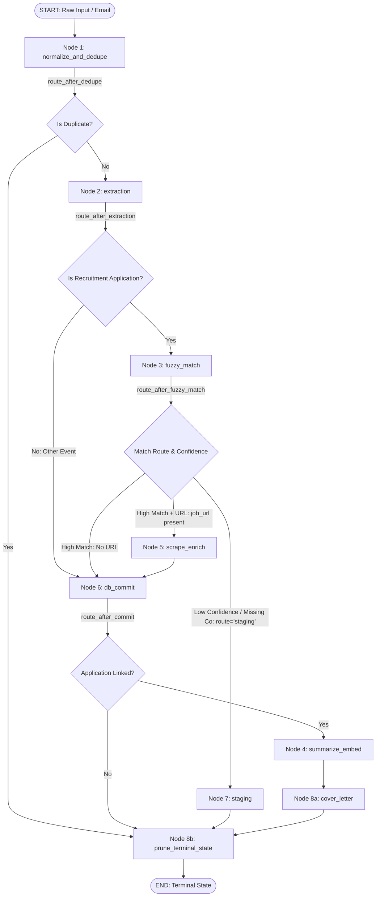
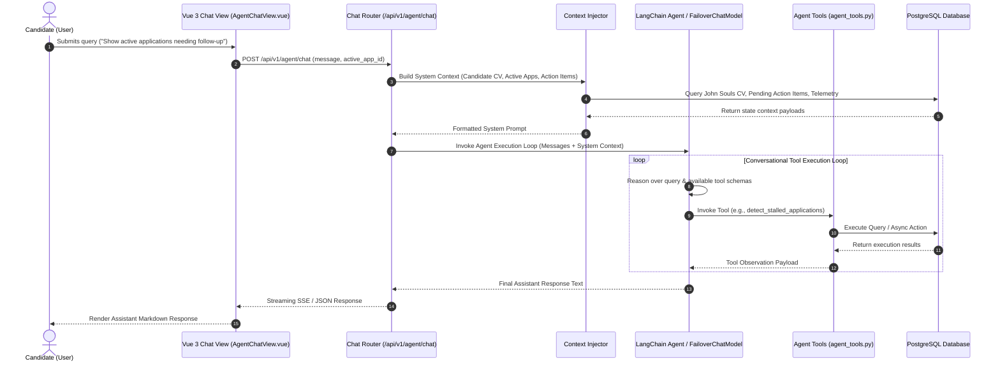

# Technical Specification: AI Architecture & Interaction Engine (`AI_ARCHITECTURE_SPEC.md`)

## 1. Executive Summary & Design Philosophy

### 1.1 Core Philosophy: Deterministic State Management vs. Probabilistic Reasoning
Modern enterprise recruitment workflows demand both high-precision data integrity and deep semantic reasoning. Legacy AI implementations often rely on naive single-shot Large Language Model (LLM) calls or unconstrained conversational chains. These approaches suffer from structural fragility, non-deterministic state transitions, race conditions, and uncontrolled hallucinations during database updates.

To achieve production-grade reliability, this application enforces a strict separation of concerns:
* **Deterministic Code Controls State:** Application lifecycle transitions, database mutations, idempotency checks, fuzzy deduplication thresholds, schema validations, and routing logic are strictly owned by explicit, type-safe Python/TypeScript state machines (powered by LangGraph and FastAPI on the backend, and Dexie.js/Pinia on the frontend).
* **Probabilistic LLMs Handle Semantic Reasoning:** LLMs are restricted to high-value cognitive tasks where semantic nuance is required—such as parsing unstructured email text, matching multi-faceted job requirements against candidate CVs, generating tailored cover letters, analyzing interview responses, and selecting agent execution tools.

By encapsulating LLM invocations inside deterministic graph nodes and isolated execution pipelines, the architecture guarantees that probabilistic model failures never corrupt database state or cause untracked data loss.

```
+-----------------------------------------------------------------------------------+
|                                  USER / API INPUT                                 |
+-----------------------------------------------------------------------------------+
                                         |
                                         v
+-----------------------------------------------------------------------------------+
|                        DETERMINISTIC STATE & ROUTING LAYER                        |
|   * LangGraph State Machine Checkpointing (PostgreSQL / Dexie.js)                 |
|   * Idempotency & Message Deduplication (ProcessedEmailModel)                     |
|   * RapidFuzz & pg_trgm Entity Resolution                                         |
+-----------------------------------------------------------------------------------+
               |                                                     ^
               | Invokes LLM with Strict Schema                      | Returns Validated
               v                                                     | Structured Model
+-----------------------------------------------------------------------------------+
|                       PROBABILISTIC SEMANTIC REASONING LAYER                      |
|   * Task-Isolated Parameter Profiles (Temperature 0.0 - 0.3)                      |
|   * Pydantic Structured Outputs & Schema Validation                                |
|   * Model-Agnostic LLM Wrappers (OpenAI / Anthropic / Gemini / Ollama)            |
+-----------------------------------------------------------------------------------+
```

---

### 1.2 Client-Server Dual Mode Architecture
The application features a hybrid architecture supporting two distinct execution models without sacrificing feature parity or user experience:

```
                                  +-----------------------+
                                  |   Application Shell   |
                                  |  (Vue 3 / Pinia Store)|
                                  +-----------------------+
                                              |
                       +----------------------+----------------------+
                       |                                             |
                       v                                             v
     +-----------------------------------+         +-----------------------------------+
     |      BACKEND STORAGE MODE         |         |        LOCAL STORAGE MODE         |
     |  (FastAPI + LangGraph + Postgres) |         |      (Client-First BYOK Engine)   |
     +-----------------------------------+         +-----------------------------------+
     | * Python LangGraph Runtime        |         | * TypeScript StorageAdapter       |
     | * Async SQLAlchemy & Alembic      |         | * Dexie.js IndexedDB Engine       |
     | * PostgreSQL + pgvector Storage   |         | * Client-side BYOK AI Client      |
     | * FailoverChatModel Server Proxy  |         | * Direct Provider CORS Fetching   |
     | * Redis/DB State Checkpointing    |         | * Local System Prompt Injection   |
     +-----------------------------------+         +-----------------------------------+
```

#### 1. Backend Runtime Mode (`backend`)
* **Core Stack:** FastAPI, LangChain, LangGraph, Async SQLAlchemy, PostgreSQL (`pgvector`, `pg_trgm`), Alembic.
* **Execution Flow:** API requests route through FastAPI endpoints (`backend/app/routers/`). Workflows execute as asynchronous state graphs managed by `build_intake_graph()` in `backend/app/services/intake_graph.py`. State checkpointer persistence is handled by `PostgresSaver` in `backend/app/core/database.py`.
* **Telemetry & Tracing:** Full server-side trace telemetry captured by `PostgresTracer` in `backend/app/services/postgres_tracer.py` and logged to the `trace_events` database table.

#### 2. Local Storage Mode (`local` / BYOK)
* **Core Stack:** Vue 3, Pinia, Dexie.js IndexedDB (`frontend/src/db/localDatabase.js`), StorageAdapter (`frontend/src/services/storageAdapter.js`), BYOK AI Client (`frontend/src/services/byokAiClient.js`).
* **Execution Flow:** Operations are handled entirely within the browser sandbox. HTTP network calls are intercepted by `storageAdapter.js` and routed to local Dexie.js databases.
* **Bring-Your-Own-Key (BYOK) AI Execution:** The browser performs direct CORS-compliant fetch requests to provider endpoints (OpenAI, Anthropic, Gemini, Ollama, LM Studio, OpenRouter) using API keys securely persisted in local browser storage (`localStorage`). System context is constructed on the fly by summarizing IndexedDB records.

---

## 2. Why LangChain & Why LangGraph (Architectural Rationale)

### 2.1 Technical Rationale for LangChain
LangChain provides the core abstractions required to maintain a provider-agnostic, enterprise-grade AI architecture across `backend/app/core/llm_factory.py` and `backend/app/services/llm.py`:

1. **Standardized Prompt Management & History Truncation:**
   * Uses `ChatPromptTemplate`, `SystemMessagePromptTemplate`, and `HumanMessagePromptTemplate` to maintain rigid separation between system instructions and untrusted user input.
   * Handles conversation history token truncation gracefully, preserving critical candidate context while remaining within model context windows.

2. **Unified Multi-Provider Integration:**
   * Abstracts differences across OpenAI (`ChatOpenAI`), Anthropic (`ChatAnthropic`), Google Gemini (`ChatGoogleGenerativeAI`), OpenRouter, and local open-source models (`Ollama`, `LM Studio`).
   * Developers interact with a single `BaseChatModel` interface, enabling seamless runtime switching via system configuration (`get_llm_client`).

3. **Structured Output Enforcement via Pydantic:**
   * Leverages LangChain's `.with_structured_output(SchemaModel)` mechanism to enforce deterministic JSON returns.
   * Eliminates raw regex parsing of LLM outputs by guaranteeing that responses adhere strictly to typed Pydantic models (e.g., `ExtractedEmailInfo`, `JobAssessmentOutput`, `STARAnalysis`).

---

### 2.2 Technical Rationale for LangGraph
Linear chain abstractions (such as standard sequential chains) fail when applied to non-linear recruitment workflows. Candidate ingestion, job evaluation, and email processing require dynamic loops, conditional validation, and human intervention.

```
       +-----------------------+
       |   START: Raw Email    |
       +-----------------------+
                   |
                   v
       +-----------------------+
       | Normalize & Dedupe    |
       +-----------------------+
                   |
         [ Is Duplicate? ]
           /           \
     (Yes) /             \ (No)
          v               v
  +---------------+   +-----------------------+
  | Terminal Exit |   | Extraction Node (LLM) |
  +---------------+   +-----------------------+
                          |
             [ Is Recruitment Email? ]
               /                 \
         (No) /                   \ (Yes)
             v                     v
   +--------------------+   +-----------------------+
   | DB Commit (Other)  |   | Fuzzy Match Node      |
   +--------------------+   +-----------------------+
                               |
                   [ Match Confidence Score ]
                     /                   \
        (Score < 0.75) /                     \ (Score >= 0.75)
                      v                       v
            +------------------+    +-------------------+
            | Staging Queue    |    | Scrape / Enrich   |
            | (Human Review)   |    +-------------------+
            +------------------+              |
                      |                       v
                      |             +-------------------+
                      |             | DB Commit (App)   |
                      |             +-------------------+
                      |                       |
                      v                       v
          +-------------------------------------------------+
          | Summarize / Embed & Cover Letter Generation     |
          +-------------------------------------------------+
                                      |
                                      v
                          +-----------------------+
                          |  Prune & Terminal END |
                          +-----------------------+
```

LangGraph was selected for the following fundamental architectural capabilities:

1. **Stateful Cyclic Execution Graphs:**
   * Recruitment ingestion is inherently non-linear. An extracted job posting may require scraping external URLs, re-evaluating fit scores if initial parsing fails, or prompting the candidate for missing information.
   * LangGraph supports directed graphs with conditional branching edges (`add_conditional_edges`), enabling multi-pass validation loops.

2. **Durable State Persistence & Checkpointing:**
   * Utilizing `PostgresSaver` checkpointers (configured in `backend/app/core/database.py`), every node transition serializes the current `JobTrackerState` to PostgreSQL.
   * If a background worker crashes or a third-party LLM endpoint times out during job extraction, execution resumes directly from the failed state checkpoint without re-running earlier steps.

3. **Human-in-the-Loop (HITL) Staging Integration:**
   * When extraction confidence falls below predefined thresholds (e.g., match confidence `< 0.75`), LangGraph routes state execution directly to the `staging_node`.
   * Execution halts and persists in `StagingItemModel`, surfacing the candidate data in the frontend Staging Triage Queue (`StagingView.vue`) for human approval or correction before committing to active application tables.

---

## 3. The Intake & Ingestion Pipeline (The 8-Node LangGraph State Machine)

The ingestion pipeline processes incoming emails, job descriptions, and browser extension captures. It is defined in `backend/app/services/intake_graph.py` and implemented across `backend/app/services/graph_nodes.py`.

### 3.1 State Machine Graph Architecture
The pipeline state is defined by the `JobTrackerState` schema (`backend/app/schemas/graph_state.py`). Below is the complete Mermaid graph diagram depicting node transitions, conditional branching, and terminal exits:



---

### 3.2 Detailed Node Specifications

#### Node 1: Raw Normalization (`normalize_and_dedupe_node`)
* **File Reference:** `backend/app/services/graph_nodes.py`
* **Functionality:** Strips raw HTML boilerplate, tracking scripts, and inline styling using `clean_html_text()` from `backend/app/core/html_utils.py`. Queries the `processed_emails` database table to verify whether `message_id` has already been ingested.
* **Deterministic Logic:**
  ```python
  if await is_email_already_processed(db, message_id):
      return {"is_duplicate": True, "route": "skip"}
  cleaned_body = clean_html_text(state.get("body", ""))
  return {"is_duplicate": False, "subject": state.get("subject", "").strip(), "body": cleaned_body}
  ```

#### Node 2: Entity Extraction (`extraction_node`)
* **File Reference:** `backend/app/services/graph_nodes.py` & `backend/app/services/llm.py`
* **Functionality:** Invokes `llm_service.extract_email_info` with parameter isolation profile `EMAIL_EXTRACTION` (Temperature `0.0`). Parses email body into the structured Pydantic schema `ExtractedEmailInfo`.
* **Pydantic Output Schema (`backend/app/schemas/intake.py`):**
  ```python
  class ExtractedEmailInfo(BaseModel):
      email_type: Literal[
          "JOB_APPLICATION", "RECRUITER_OUTREACH", "INTERVIEW_INVITE",
          "ASSESSMENT_REQUEST", "OFFER", "REJECTION", "NEWSLETTER", "SPAM", "OTHER"
      ]
      company: str | None = None
      position: str | None = None
      status: str | None = None
      event_type: str | None = None
      job_url: str | None = None
      action_required: bool = False
      action: str | None = None
      due_date: str | None = None
      summary: str = ""
  ```

#### Node 3: Fuzzy Company Resolution (`fuzzy_match_node`)
* **File Reference:** `backend/app/services/graph_nodes.py`
* **Functionality:** Normalizes extracted company and position names. Executes string similarity matching against existing database records using RapidFuzz ratio (`fuzz.ratio`) and PostgreSQL trigram matching (`pg_trgm`).
* **Routing Rules:**
  * **Missing Company Name:** Match Score `0.0` $\rightarrow$ Route to `staging_node` (`match_reason="MISSING_COMPANY_NAME"`).
  * **Score $< 0.75$ (`STAGING_MATCH_THRESHOLD`):** Route to `staging_node` (`match_reason="NEW_COMPANY_LEAD"`).
  * **Multiple Matching Applications:** Disambiguates by position name similarity. If position match $< 0.75$, routes to `staging_node` (`match_reason="AMBIGUOUS_MULTIPLE_APPLICATIONS"`).
  * **High Confidence Score $\ge 0.75$:** Auto-links to existing `CompanyModel` / `ApplicationModel` and routes to `db_commit_node`.

#### Node 4: Skill Taxonomy Mapping & Embedding (`summarize_embed_node`)
* **File Reference:** `backend/app/services/graph_nodes.py` & `backend/app/services/llm.py`
* **Functionality:** Extracts canonical technical skills, domain competencies, and salary parameters from job postings. Note: Raw intake vector embedding generation is explicitly deferred during initial email ingestion to prevent redundant processing; vector embeddings are generated when applications undergo active lifecycle state updates or evaluation worker passes.

#### Node 5: Web Scraping & Enrichment (`scrape_enrich_node`)
* **File Reference:** `backend/app/services/graph_nodes.py` & `backend/app/services/scraper.py`
* **Functionality:** Triggered when `job_url` is present. Normalizes candidate tracking links via `normalize_job_url()` (stripping `utm_*`, `ref`, `gclid`). Invokes `scrape_job_url()` using Camofox/HTTPX to pull full job description markdown, enriching `scraped_spec`.

#### Node 6: Database Persistence (`db_commit_node`)
* **File Reference:** `backend/app/services/graph_nodes.py`
* **Functionality:** Handles transactional persistence:
  * For non-recruitment items: Inserts `OtherEventModel` record.
  * For recruitment applications: Upserts `CompanyModel` and `ApplicationModel`, logs `ApplicationEventModel`, and creates urgent `ActionItemModel` records if `action_required == True`.
  * Upserts `ProcessedEmailModel` status (`ingested`, `staged`, `other_event`).

#### Node 7: Staging Triage Routing (`staging_node`)
* **File Reference:** `backend/app/services/graph_nodes.py`
* **Functionality:** Intercepts low-confidence or ambiguous extractions. Creates/updates a `StagingItemModel` record with status `PENDING`, preserving extracted JSON and raw email body for human review in `StagingView.vue`.

#### Node 8: Notification & Cover Letter Execution (`cover_letter_node` & `prune_terminal_state_node`)
* **File Reference:** `backend/app/services/graph_nodes.py`
* **Functionality:** Checks system settings (`ENABLE_AUTO_COVER_LETTER` and `COVER_LETTER_MATCH_THRESHOLD`). If the candidate match score meets the threshold, invokes `generate_cover_letter()`. Finally, `prune_terminal_state_node` strips heavy transient strings (`scraped_spec`, `body`) before checkpointer serialization.

---

## 4. Task Studio & Parameter Isolation

### 4.1 Parameter Isolation Philosophy
In enterprise AI applications, using a uniform global LLM configuration (e.g., Temperature `0.7` across all tasks) leads to system degradation:
* High creativity (Temperature $\ge 0.5$) during JSON entity extraction leads to malformed schemas, missing keys, and database insertion crashes.
* Zero creativity (Temperature $0.0$) during cover letter generation yields robotic, repetitive prose that hurts candidate outreach conversion rates.

To solve this, the architecture enforces **Task Parameter Isolation**. Every AI service task declares an immutable, purpose-built configuration profile specifying model temperature, max tokens, top-p, system prompt templates, and Pydantic output parsers.

---

### 4.2 Parameter Isolation Profile Matrix

| Isolation Engine Key | Target Function / File Location | Temp | Top-P | Output Formatting Strategy | Primary Technical Rationale |
| :--- | :--- | :--- | :--- | :--- | :--- |
| `JD_EXTRACTION` | `extract_job_spec()`<br>`backend/app/services/llm.py` | `0.0` | `1.0` | Strict Pydantic JSON<br>(`JobPostingParsed`) | Zero hallucination tolerance. Requires exact extraction of job title, requirements, salary ranges, and tech stack. |
| `EMAIL_EXTRACTION` | `extract_email_info()`<br>`backend/app/services/llm.py` | `0.0` | `1.0` | Strict Pydantic JSON<br>(`ExtractedEmailInfo`) | Guarantees deterministic parsing of dates, senders, status types, and action items from email bodies. |
| `JOB_ASSESSMENT` | `evaluate_job_fit()`<br>`backend/app/services/llm.py` | `0.1` | `0.9` | Structured JSON<br>(`fit_score`, `gaps`, `strengths`) | High analytical consistency. Ensures fit scores (0–100) and skill gap matrix calculations remain stable across re-runs. |
| `COVER_LETTER` | `generate_cover_letter()`<br>`backend/app/services/llm.py` | `0.3` | `0.95` | Plaintext Markdown Prose | Balances creative professional prose with strict candidate CV context alignment (John Souls persona). |
| `INTERVIEW_GUIDE` | `generate_interview_guide()`<br>`backend/app/services/interview_guide.py` | `0.3` | `0.95` | Structured JSON / Streaming SSE | Generates tailored questions, technical topics, and candidate STAR preparation talking points. |
| `AGENT_REASONING` | `agent_chat_node()`<br>`backend/app/routers/agent_chat.py` | `0.3` | `0.9` | LangChain Tool Calls / React Agent Loop | Fast, decisive reasoning for tool selection, multi-turn plan step execution, and system context synthesis. |
| `INTERVIEW_SIMULATOR` | `evaluate_turn()`<br>`backend/app/routers/interview_simulator.py` | `0.2` | `0.9` | Strict Pydantic JSON<br>(`STARAnalysis`) | Strict evaluation guard rails. Formats STAR scores without asking follow-up questions during feedback passes. |

---

## 5. The Agent Chat & Reasoning Engine

### 5.1 System Architecture & Flow
The Agent Chat Engine (`backend/app/routers/agent_chat.py`) provides a multi-turn conversational assistant capable of querying application state, updating job pipelines, triggering background scrapers, and performing vector searches.



---

### 5.2 Context Injection Mechanics
Before passing a candidate's message to the agent execution loop, `agent_chat.py` injects a real-time system prompt context snapshot containing:
1. **Candidate Profile Context:** Profile overview for candidate **John Souls** (Senior Staff Full-Stack & AI Systems Engineer), including core competencies, years of experience, and target locations.
2. **Pipeline State Snapshot:** Counts of active applications organized by stage (`APPLIED`, `TECHNICAL_INTERVIEW`, `OFFER`, `HIRED`, `REJECTED`).
3. **Pending Action Items:** Top urgent pending action items sorted by due date and urgency rating (`HIGH`, `MEDIUM`).
4. **Active Application Focused Detail:** Full job description, salary range, match analysis, and interaction notes if the chat session is opened within a specific application context drawer.

---

### 5.3 Registered Agent Tools Suite
The agent accesses 11 custom execution tools defined in `backend/app/services/agent_tools.py` with Pydantic input schemas (`backend/app/schemas/agent_tools.py`):

```python
# Multi-tool concurrent execution model in agent_chat.py
tool_map = {tool.name: tool for tool in create_agent_tools(db)}
tasks = [tool_map[call.name].ainvoke(call.args) for call in tool_calls]
tool_results = await asyncio.gather(*tasks)
```

1. `list_applications`: Filter and retrieve application records by status, company name, or date range.
2. `get_application_details`: Fetch full application details, including salary, job postings, and timeline events.
3. `update_application_pipeline`: Transition an application stage (e.g., advance from `APPLIED` to `TECHNICAL_INTERVIEW`).
4. `detect_stalled_applications`: Identify applications stuck in a pipeline stage exceeding configurable day thresholds.
5. `manage_action_items`: Create, complete, or list pending candidate action items.
6. `manage_intake_queue`: Review, retry, cancel, or approve items in the background intake evaluation queue.
7. `semantic_vector_search`: Execute `pgvector` similarity queries across job descriptions, company profiles, and interview notes.
8. `evaluate_ai_fit_score`: Trigger deep job fit evaluation comparing candidate CV against target job postings.
9. `analyze_pipeline_metrics`: Fetch conversion funnel metrics, weekly trends, and response rate analytics.
10. `query_market_benchmarks`: Compare application salary bands against regional and title benchmarks.
11. `generate_mock_interview_question`: Produce targeted interview practice questions tailored to job requirements.

---

### 5.4 Client-Side Local Mode Adaptation
In client-first local mode (`frontend/src/demo/` or `localStorage` BYOK mode), the agent loop operates entirely inside the browser:
* `byokAiClient.js` loads candidate profile data, active applications, and action items directly from Dexie.js IndexedDB.
* It formats system context dynamically and issues direct fetch calls to local/cloud LLM provider endpoints (e.g., Ollama at `http://localhost:11434`, LM Studio at `http://localhost:1234`, or OpenAI API).
* Tool execution is simulated or routed through client storage adapters (`storageAdapter.js`), maintaining complete operational privacy without backend server dependency.

---

## 6. The Interactive Mock Interview Simulator

### 6.1 Multi-Turn Role-Playing Architecture
The Mock Interview Simulator (`backend/app/routers/interview_simulator.py` & `backend/app/services/interview_simulator_service.py`) provides real-time, interactive technical and behavioral interview practice.

Each interview session is persisted in the `interview_sessions` database table (`InterviewSessionModel`) with a structured state representation:
* **Session Attributes:** `application_id`, `interviewer_persona`, `overall_score`, `readiness_rating`, `turns_data` (JSONB array of transcript turns), `summary_feedback` (JSONB).

---

### 6.2 Candidate Persona Context: John Souls
Throughout interview simulation runs, the AI engine evaluates candidate responses against candidate persona **John Souls**:
* **Profile:** Senior Staff Full-Stack & AI Systems Engineer (10+ years experience).
* **Core Competencies:** Distributed Systems, Python/FastAPI, TypeScript/Vue 3, LangChain/LangGraph, PostgreSQL/pgvector, Cloud Architecture.
* **Evaluation Context:** Ensures the evaluator measures candidate answers against expected Senior/Staff-level technical depth, architectural trade-off reasoning, and leadership impact.

---

### 6.3 Interactivity & Interviewer Personas
Users can configure 4 distinct interviewer personas, each injecting specific system behavior rules into the simulation loop:

```python
INTERVIEWER_PERSONAS = {
    "TECHNICAL_BAR_RAISER": (
        "Focus heavily on system design trade-offs, concurrency, low-level architecture, "
        "and algorithmic scalability. Challenge vague assumptions and press for exact metrics."
    ),
    "HIRING_MANAGER": (
        "Focus on business impact, cross-functional project execution, prioritization, "
        "and technical roadmap alignment. Evaluate strategic thinking and team leadership."
    ),
    "BEHAVIORAL_CULTURE": (
        "Focus strictly on STAR methodology (Situation, Task, Action, Result), conflict resolution, "
        "ownership, adaptability, and culture alignment."
    ),
    "SUPPORTIVE_COACH": (
        "Provide constructive, encouraging guidance while highlighting candidate strengths "
        "and providing actionable suggestions for improvement."
    )
}
```

---

### 6.4 STAR Evaluation Rubric & Prompt Guard Architecture
The simulator separates question generation from response evaluation to prevent model bias and maintain evaluation integrity.

```
                  +-----------------------------------+
                  | Candidate Submits Audio / Text    |
                  +-----------------------------------+
                                    |
                                    v
                  +-----------------------------------+
                  | TURN EVALUATION PASS (Temp 0.2)    |
                  | Prompt Guard: DO NOT GENERATE     |
                  | FOLLOW-UP QUESTION IN THIS PASS   |
                  +-----------------------------------+
                                    |
                                    v
                  +-----------------------------------+
                  | Structured Pydantic Output:       |
                  | * Situation Score (0-10)          |
                  | * Task Score (0-10)               |
                  | * Action Score (0-10)             |
                  | * Result Score (0-10)             |
                  | * Strengths & Gaps Arrays         |
                  | * Exemplar STAR Rewrite           |
                  +-----------------------------------+
                                    |
                                    v
                  +-----------------------------------+
                  | QUESTION GENERATION PASS          |
                  | Generates Next Interview Question |
                  +-----------------------------------+
```

#### Evaluation Prompt Guard Enforcement:
During evaluation passes, system prompts enforce strict evaluation guards forbidding the LLM from asking follow-up questions within the evaluation payload:

```python
EVALUATION_PROMPT_GUARD = """
CRITICAL INSTRUCTION: You are acting purely as an evaluator for this turn.
Analyze the candidate's answer against the STAR rubric.
DO NOT include any follow-up interview questions, pleasantries, or conversational filler in your JSON output.
Your output MUST strictly match the STARAnalysis schema.
"""
```

#### Pydantic Evaluation Schema (`STARAnalysis`):
```python
class STARAnalysis(BaseModel):
    situation_score: int = Field(ge=0, le=10, description="Clarity of context and business challenge")
    task_score: int = Field(ge=0, le=10, description="Definition of candidate responsibility")
    action_score: int = Field(ge=0, le=10, description="Depth of personal technical actions taken")
    result_score: int = Field(ge=0, le=10, description="Quantifiable business results and metrics")
    overall_turn_score: int = Field(ge=0, le=10)
    strengths: list[str]
    gaps: list[str]
    exemplar_star_rewrite: str = Field(description="Optimized rewrite of candidate answer using STAR format")
```

---

### 6.5 Live Score Indicators & Debrief Scorecards
* **Real-Time HUD (Frontend):** The Vue 3 interview view (`AgentChatView.vue`) renders a live split-pane HUD containing real-time score gauges, STAR vector badges, and strength/gap lists updated after every turn.
* **Final Session Debrief Scorecard:** When a candidate finalizes a session (`POST /api/v1/interviews/sessions/{id}/finalize`), the engine calculates cumulative performance metrics, stores structured debrief scorecards, emits an Application Timeline Event, and allows candidates to save markdown notes directly to `ApplicationModel.notes`.

---

## 7. Semantic Vector & pgvector Embeddings Architecture

### 7.1 Database Schema & `pgvector` Integration
The backend utilizes PostgreSQL's `pgvector` extension to store and query vector embeddings natively within relational tables.

* **Vector Dimensions:**
  * OpenAI `text-embedding-3-small`: 1536 dimensions.
  * Local / Ollama (`nomic-embed-text` / `bge-small`): 768 dimensions.
* **Storage Schema (`backend/app/models/applications.py`):**
  ```sql
  -- Vector embedding column definition on ApplicationModel
  ALTER TABLE applications ADD COLUMN IF NOT EXISTS embedding vector(1536);

  -- HNSW Vector Index for fast cosine similarity search
  CREATE INDEX IF NOT EXISTS idx_applications_embedding_hnsw
  ON applications USING hnsw (embedding vector_cosine_ops);
  ```

---

### 7.2 Semantic Skill Transferability (Beyond Keyword Matching)
Traditional keyword matching fails when candidate profile terms do not match job description jargon exactly (e.g., searching for "FastAPI" misses "Python Microservices", or searching for "PyTorch" misses "Deep Learning").

By generating vector embeddings of candidate experience profiles (**John Souls**) and job posting requirements, the application calculates cosine similarity over dense semantic vector space:

$$\text{Similarity Score} = \cos(\theta) = \frac{\mathbf{A} \cdot \mathbf{B}}{\|\mathbf{A}\| \|\mathbf{B}\|}$$

```
   Candidate Vector (John Souls)               Job Description Vector
   "FastAPI, Async Python, PostgreSQL"          "High-Throughput Python Web APIs"
                  \                                   /
                   \                                 /
                    v                               v
          +-----------------------------------------------+
          | Cosine Distance in 1536-D Vector Space = 0.89  |
          | HIGH SEMANTIC MATCH (No exact string match)   |
          +-----------------------------------------------+
```

This enables automatic identification of transferable skills across frameworks, programming languages, and architectural domains.

---

### 7.3 Historical Pipeline Intelligence & Rejection Pattern Clustering
The vector engine indexes historical application records, interview feedback notes, and rejection emails to provide predictive insights:
1. **Rejection Reason Clustering:** Vector embeddings of rejection emails are clustered using cosine distance to group rejections into core categories (e.g., *Lack of Kubernetes Hands-On*, *Salary Expectation Mismatch*, *Seniority/Staff Banding Shift*).
2. **Pipeline Bottleneck Detection:** The tool `detect_stalled_applications` cross-references vector similarity against historical stage durations, warning candidates when an application resembles historically stalled or rejected pipelines.

---

### 7.4 Conversational RAG over Interview & Recruiter Notes
During agent chat conversations (`backend/app/routers/agent_chat.py`), candidates can query past interactions across all applications using Retrieval-Augmented Generation (RAG):

```python
# Semantic vector search tool implementation in agent_tools.py
@tool("semantic_vector_search")
async def semantic_vector_search(query: str, db: AsyncSession, top_k: int = 5):
    """Executes pgvector cosine distance search across application embeddings and interview notes."""
    query_vector = await generate_embedding(query)
    stmt = (
        select(ApplicationModel)
        .order_by(ApplicationModel.embedding.cosine_distance(query_vector))
        .limit(top_k)
    )
    results = await db.execute(stmt)
    return results.scalars().all()
```

---

### 7.5 Automated STAR Story Matching
When preparing for upcoming technical or behavioral interviews, the engine runs vector similarity comparisons between candidate achievement stories in **John Souls's** profile and key requirements listed in target job descriptions:
1. Candidate CV accomplishments are chunked and vectorized into achievement vectors.
2. Job posting requirements are vectorized into requirement vectors.
3. Cosine matrix multiplication identifies the top 3 candidate STAR stories that best match specific job requirements, populating the candidate's custom Interview Guide.

---

## 8. Resiliency, Error Recovery, and Fallbacks

### 8.1 Failover Architecture & Provider Recovery
To protect against provider API outages, rate limit breaches (`HTTP 429`), network socket timeouts, and malformed LLM outputs, the application implements multi-layered resiliency patterns.

```
                          +------------------------------------+
                          | Primary AI Provider Request        |
                          | (e.g., OpenAI / Anthropic)         |
                          +------------------------------------+
                                            |
                                  [ Request Succeeds? ]
                                   /                 \
                             (Yes)/                   \(No: Timeout / 429 / 5xx)
                                 v                     v
                        +-----------------+   +------------------------------------+
                        | Return Payload  |   | Automatic FailoverChatModel        |
                        +-----------------+   | Interceptor (llm_factory.py)       |
                                              +------------------------------------+
                                                               |
                                                               v
                                              +------------------------------------+
                                              | Execute Secondary Provider         |
                                              | (e.g., Gemini / OpenRouter / Local)|
                                              +------------------------------------+
                                                               |
                                                               v
                                              +------------------------------------+
                                              | Write Failure Trace to             |
                                              | trace_events Database Table        |
                                              +------------------------------------+
```

---

### 8.2 Primary-Secondary Automatic Failover (`FailoverChatModel`)
* **File Reference:** `backend/app/core/llm_factory.py`
* **Implementation:** The `FailoverChatModel` class wraps primary and fallback LangChain `BaseChatModel` instances.
* **Execution Logic:** If the primary provider raises a connection error, API timeout, or authentication failure, `FailoverChatModel` intercepts the exception, records a diagnostic trace event to `trace_events`, and immediately routes the request to the configured secondary provider (e.g., falling back from OpenAI to Gemini or Ollama).

```python
class FailoverChatModel(BaseChatModel):
    primary_model: BaseChatModel
    fallback_model: BaseChatModel

    async def _agenerate(self, messages, stop=None, run_manager=None, **kwargs):
        try:
            return await self.primary_model._agenerate(messages, stop=stop, run_manager=run_manager, **kwargs)
        except Exception as primary_err:
            logger.warning("Primary LLM provider failed: %s. Initiating failover.", primary_err)
            await log_trace_event(event_type="PROVIDER_FAILOVER", error=str(primary_err))
            return await self.fallback_model._agenerate(messages, stop=stop, run_manager=run_manager, **kwargs)
```

---

### 8.3 LangGraph Node Retry & Resumption Policies
* **Exponential Backoff Retries:** Node executions facing transient errors (e.g., HTTP timeout during web scraping) execute automatic retries with exponential backoff (`retries=3`, `backoff_factor=1.5`).
* **Checkpoint Resumption:** Because state is serialized via `PostgresSaver` at every node boundary, background workers handling failed tasks resume directly from the checkpoint node where failure occurred, avoiding re-execution of previously completed phases.
* **Invalid Job Content Handling:** If web scraping yields non-job content or fewer than 2 European job keywords, `validate_job_content()` fails the task with status `INVALID_JOB_CONTENT`, allowing candidates to fix job descriptions manually via `POST /api/v1/intake/evaluations/{task_id}/fix-jd`.

---

### 8.4 Client-Side Local Mode Resiliency
* **Defensive Toast Notifications & Soft Disabling:** When local BYOK LLM endpoints (e.g., Ollama or LM Studio) are offline, `initAIHealthMonitor()` in `uiStore.js` updates system health state (`ai_ready: false`).
* **Quick Retry & Configuration Modals:** UI components render soft-disabled AI triggers and surface `QuickRetryModal.vue`, permitting candidates to update local endpoints or switch to manual input modes seamlessly.
