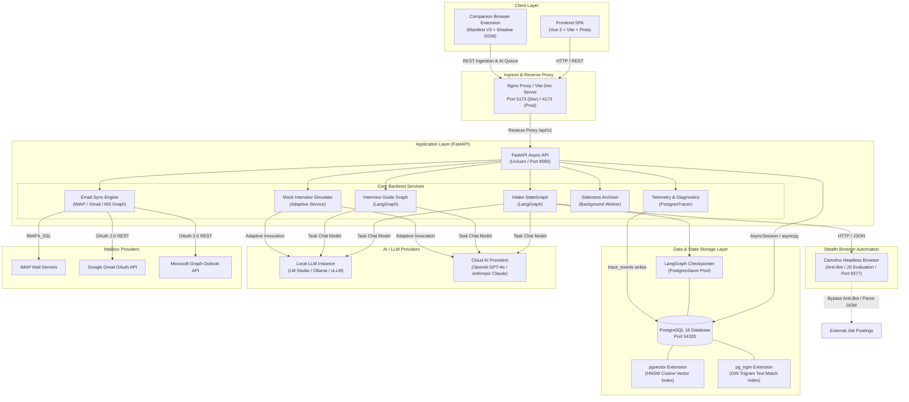
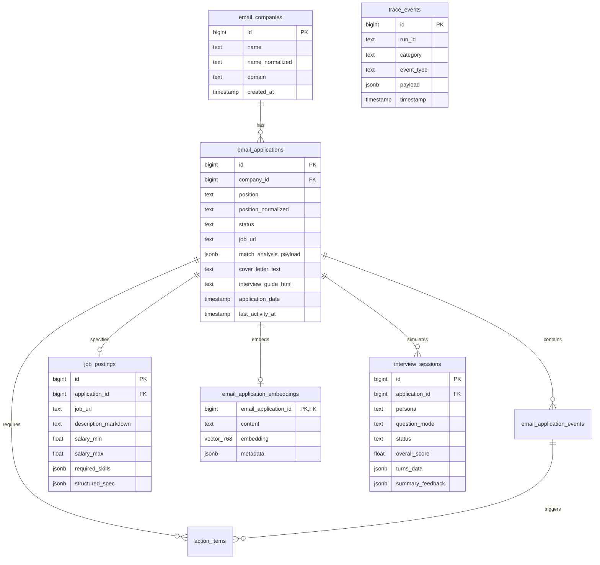
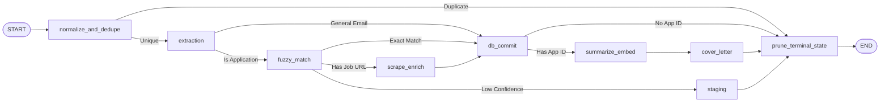
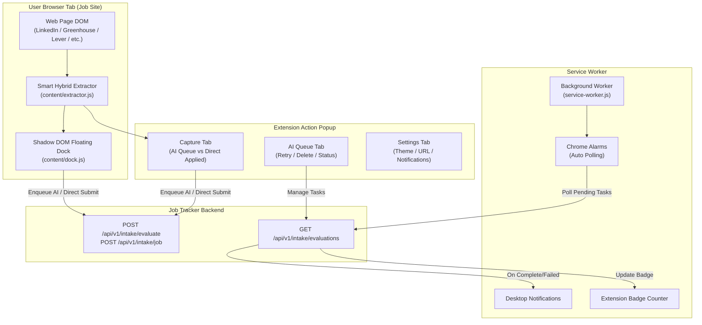

# System Architecture Documentation

## 1. System Overview & Philosophy

**Job Tracker** is an open-source, privacy-first, full-stack application designed to automate and streamline the job application and recruitment lifecycle. The system provides intelligent extraction from job postings and recruiter emails, AI-driven candidate-job fit analysis, automated cover letter drafting, interview preparation guide generation, and an interactive real-time mock interview simulator.

```
┌─────────────────────────────────────────────────────────────────────────────┐
│                              JOB TRACKER CORE                               │
│                                                                             │
│  ┌───────────────────────┐   ┌───────────────────┐   ┌───────────────────┐  │
│  │   Privacy-First &     │   │   Hybrid AI LLM   │   │  End-to-End Flow  │  │
│  │     Local-First       │   │   Orchestration   │   │    Automation     │  │
│  │                       │   │                   │   │                   │  │
│  │ • 100% local database │   │ • Local LM Studio │   │ • 1-Click Intake  │  │
│  │ • Zero cloud telemetry│   │ • Ollama / vLLM   │   │ • Email Sync      │  │
│  │ • Encrypted storage   │   │ • OpenAI / Claude │   │ • Mock Simulator  │  │
│  └───────────────────────┘   └───────────────────┘   └───────────────────┘  │
└─────────────────────────────────────────────────────────────────────────────┘
```

### Core Architectural Principles
1. **Privacy-First & Local-First:** All candidate resumes, job applications, correspondence, and recruitment timelines are stored locally in a self-hosted PostgreSQL database. Users have the freedom to execute all AI tasks using entirely local models (via LM Studio, Ollama, or vLLM) with zero data transmission to third parties.
2. **Adaptive LLM Orchestration:** Built on LangChain and LangGraph, the AI layer dynamically configures timeouts, concurrency limits, and token budgets depending on whether a task is bound to a local model or a cloud provider (OpenAI, Anthropic).
3. **Resilient Asynchronous Pipelines:** Heavy workloads—including browser automation, web scraping, email mailbox synchronization, vector embedding generation, and multi-turn interview simulations—execute asynchronously without blocking user interactions.
4. **Observable by Design:** Every LLM call, scraper execution, email synchronization pass, and background worker lifecycle event registers detailed telemetry in the `trace_events` diagnostics store.

---

## 2. High-Level Architecture Diagram



---

## 3. Backend Architecture

The backend is built with **FastAPI** on **Python 3.12+**, leveraging an end-to-end asynchronous architecture driven by `asyncpg`, `SQLAlchemy 2.0 Async`, and `LangGraph`.

```
backend/
├── alembic/                  # Alembic migration scripts and async environment
│   └── versions/             # Reversible schema revision files
├── app/
│   ├── core/                 # App configuration, database engine, LLM factory, prompts
│   │   ├── config.py         # Pydantic Settings management
│   │   ├── database.py       # Async SQLAlchemy session and connection pools
│   │   └── llm_factory.py    # Dynamic multi-provider AI model resolver
│   ├── models/               # SQLAlchemy ORM declarative models
│   ├── routers/              # FastAPI REST endpoints
│   ├── schemas/              # Pydantic request/response validation schemas
│   └── services/             # Core business logic, graphs, scrapers, and workers
└── tests/                    # Pytest test suite with Testcontainers integration
```

### 3.1 Async Database & Persistence Architecture
- **Async Engine & Session Management:** Utilizes `create_async_engine` with `asyncpg` driver and `async_sessionmaker(expire_on_commit=False)` for non-blocking database queries.
- **Connection Pools:** Employs dual pooling:
  1. SQLAlchemy asynchronous connection pool for application REST transactions.
  2. `psycopg_pool.AsyncConnectionPool` for LangGraph `PostgresSaver` checkpointers.
- **pgvector Vector Embeddings:** Semantic representation of job applications and candidate profiles are stored in the `email_application_embeddings` table (`Vector(768)`) and indexed with **HNSW** (`vector_cosine_ops`) for sub-millisecond similarity search.
- **pg_trgm Fuzzy String Matching:** Fast, typo-tolerant company and job title matching via PostgreSQL GIN trigram indexes (`gin_trgm_ops`) on normalized entity columns (`email_companies.name_normalized`).
- **Alembic Async Migrations:** All schema alterations are version-controlled via Alembic migrations executed with the `async_engine`.



### 3.2 LangGraph & LangChain State Machines

#### A. Intake Pipeline Graph (`intake_graph.py`)
Processes unstructured job leads, URLs, raw text, and incoming recruitment emails through an 8-node state machine:



- **`normalize_and_dedupe`**: Checks message IDs and canonical URL hashes to reject duplicate events.
- **`extraction`**: Extracts company name, job title, recruiter details, dates, and event type.
- **`fuzzy_match`**: Resolves company entities using GIN trigram matching; flags ambiguous records to `staging`.
- **`scrape_enrich`**: Calls Camofox scraper to retrieve full job markdown and requirements.
- **`db_commit`**: Writes application records, company links, and timeline events to PostgreSQL.
- **`summarize_embed`**: Generates 768-dimension semantic embeddings and persists to `email_application_embeddings`.
- **`cover_letter`**: Optionally drafts a targeted cover letter aligned with the candidate's active CV.
- **`prune_terminal_state`**: Strips bulky transient strings prior to checkpointer persistence.

#### B. Interview Guide Graph (`interview_guide_graph.py`)
A state machine that synthesizes comprehensive interview dossiers in Markdown and HTML through a multi-pass section generator:
1. **Role & Company Brief:** Culture signals, engineering challenges, first 90-day success metrics.
2. **Strategic Fit & Elevator Pitch:** 60-90 second introduction matching candidate strengths to the job.
3. **Tailored STAR Stories:** Situation, Task, Action, Result narratives mapping past projects to requirements.
4. **Question Defenses:** High-probability behavioral and technical questions with gap-mitigation strategies.
5. **Questions to Ask Interviewer:** Strategic questions demonstrating domain mastery.
6. **Pre-Interview Checklist:** High-priority refresher bullet list.

#### C. Interactive Mock Interview Simulator (`interview_simulator_service.py`)
An interactive simulator supporting live multi-turn role-playing interviews:
- **Question Formats:** `TEXT_CONVERSATIONAL`, `MULTIPLE_CHOICE`, and `HYBRID`.
- **Interviewer Personas:** `TECHNICAL_BAR_RAISER`, `HIRING_MANAGER`, `BEHAVIORAL_CULTURE`, and `SUPPORTIVE_COACH`.
- **Adaptive Timeout Strategy:** Automatically detects local LLM endpoints (LM Studio, Ollama) and applies an infinite timeout to accommodate slower hardware, while enforcing a 120s timeout on cloud endpoints.
- **STAR Real-Time Scoring:** Evaluates candidate answers per turn and produces a structured debrief scorecard with quantitative ratings, strengths, growth areas, and timeline event records.

---

### 3.3 Camofox Stealth Web Scraper
The stealth scraper (`scraper.py`) interfaces with a dedicated headless browser container (`ghcr.io/jo-inc/camofox-browser`) to reliably bypass anti-scraping defenses:
- **Anti-Bot & Fingerprint Evasion:** Camofox randomizes WebGL, canvas, and browser attributes to evade bot detection.
- **JavaScript Injection (`EXPAND_JS`):**
  - Automatically scrolls to trigger lazy loading of asynchronous elements.
  - Detects and removes cookie consent popups and modal backdrops (OneTrust, Didomi, CookieNotice).
  - Clicks truncated description toggles ("Show more", "Read full description", LinkedIn buttons).
- **Multi-Engine Fallback:** If Camofox is unreachable or disabled, falls back to direct asynchronous HTTP retrieval with BeautifulSoup parsing.
- **SSRF Protection:** Validates requested IP targets to prevent private network scanning.

---

### 3.4 Multi-Provider Email Synchronization Engine
`email_fetcher.py` and `oauth_adapters.py` orchestrate background email ingestion across three major protocols:
1. **IMAP4_SSL (`_fetch_imap_emails_sync`):** Connects securely via SSL, decodes RFC-2047 headers, searches emails by timestamp/criterion, and fetches bodies and attachments in configurable batches.
2. **Google Gmail API (`GmailOAuthAdapter`):** Uses OAuth 2.0 user credentials, performs token auto-refresh, and parses MIME payloads.
3. **Microsoft Graph API (`MicrosoftGraphAdapter`):** Integrates with Outlook / Office 365 mailboxes via MS Graph REST API.

All incoming emails are deduplicated via unique `message_id` hashes, converted into standardized `EmailPayload` schemas, and fed into the intake pipeline.

---

### 3.5 Telemetry & Diagnostics Engine
System observability is enforced across both AI and non-AI workloads:
- **`trace_events` Table:** Structured schema storing run ID, category (`llm`, `scraper`, `email_sync`, `worker`, `embedding`), event type, timestamps, execution durations, inputs, and serialized outputs or error tracebacks.
- **`PostgresTracer`:** An `AsyncBaseTracer` that hooks into LangChain and LangGraph callback systems, capturing full prompts, token counts, and completion responses in real time.
- **`trace_operation` Context Manager:** An asynchronous context manager for wrapping programmatic tasks (scrapers, email sync, vector embeddings, background workers) to log timing, sanitized payloads, and unhandled exceptions.

```python
# Example: Tracing a custom background task
from app.services.telemetry import trace_operation

async def sync_mailbox(account_id: int):
    async with trace_operation(
        category="email_sync",
        name="sync_mailbox",
        inputs={"account_id": account_id},
    ) as ctx:
        emails = await fetch_new_messages(account_id)
        ctx["outputs"] = {"fetched_count": len(emails)}
```

---

## 4. Frontend Architecture

The frontend is a single-page application (SPA) built with **Vue 3**, **Vite**, **Pinia**, and **lucide-vue-next**.

```
frontend/
├── src/
│   ├── api/                  # Axios/Fetch client and endpoint definitions
│   ├── components/           # Reusable UI components
│   │   ├── agent/            # FloatingAgentChatWidget, message bubbles
│   │   ├── common/           # CompanyLogo, DateTimePicker, ToastNotification
│   │   ├── drawers/          # ApplicationDetailDrawer, IntakeQueueDrawer
│   │   ├── layout/           # AppNavbar, ThemePalettePopover, FloatingQueueWidget
│   │   └── modals/           # MatchAnalysisModal, CoverLetterModal, PostHireModal
│   ├── stores/               # Pinia reactive state stores
│   │   ├── agentChatStore.js # Chat assistant and mock interview session state
│   │   ├── applicationsStore.js # Applications Kanban, filters, bulk transitions
│   │   ├── interviewStore.js # Live interview simulation state and STAR debriefs
│   │   ├── queueStore.js     # Ingestion evaluation queue and background polling
│   │   └── uiStore.js        # Global modals, theme state, and drawer visibility
│   ├── views/                # Top-level route views
│   └── style.css             # Design tokens and custom theme properties
└── vite.config.js            # Vite build configuration and reverse proxy
```

### 4.1 Pinia Reactive Stores
- **`applicationsStore`**: Manages the Kanban application board across all stages (`APPLIED`, `ONLINE_ASSESSMENT`, `TECHNICAL_INTERVIEW`, `OFFER`, `HIRED`, `ARCHIVED`, `WITHDRAWN`, `REJECTED`), optimistic drag-and-drop state updates, chronological sorting, and bulk stage transitions.
- **`queueStore`**: Manages real-time AI evaluation tasks, auto-polling active items, and bulk retry/delete actions.
- **`agentChatStore`**: Maintains chat session history, conversational drill-downs, and autonomous assistant tool invocations.
- **`interviewStore`**: Drives the live interactive mock interview simulation, streaming turns, multiple-choice state, and scorecards.
- **`uiStore`**: Coordinates global layout drawers, modal dialogues, toasts, and active theme persistence.

### 4.2 Theme Engine & Design System
- **Theme Palette Popover:** Supports instant switching between:
  - `Daylight` (Warm saddle brown / amber light mode)
  - `Midnight` (Deep cyan / slate dark mode)
  - `System Default` (Auto-matches OS preference via `prefers-color-scheme`)
- **Global Floating Widgets:**
  - `FloatingAgentChatWidget`: Always-available AI assistant drawer for querying applications or launching mock interviews.
  - `FloatingQueueWidget`: Real-time status indicator of background AI ingestion tasks with an interactive drawer.

---

## 5. Browser Extension Architecture

The **Job Tracker Companion** extension is built on **Manifest V3** to capture job postings directly from browser tabs into the Job Tracker pipeline.

```
extension/
├── background/
│   └── service-worker.js     # Background worker: polling, badge counter, notifications
├── content/
│   ├── dock.js               # Shadow DOM isolated floating in-page dock
│   └── extractor.js          # Smart Hybrid DOM parsing engine
├── popup/
│   ├── popup.html            # Multi-tab popup interface
│   ├── popup.js              # Tab controller, form handling, queue actions
│   └── popup.css             # Extension styling with light/dark theme support
├── utils/
│   ├── api.js                # Extension API client with health checks
│   └── storage.js            # Chrome Storage Sync / Local wrapper
└── manifest.json             # Manifest V3 configuration (Chromium & Gecko)
```



### 5.1 Key Extension Features
1. **Shadow DOM Floating Dock (`dock.js`):**
   - Injected into active tabs matching known ATS platforms (LinkedIn, Greenhouse, Lever, Workday, Ashby, Indeed, Glassdoor) or career URLs.
   - Fully isolated inside a Shadow DOM tree to prevent host CSS conflicts.
   - Draggable handle and collapsible pill with 1-click **Enqueue AI Assessment** and **Direct Applied** actions.
2. **Smart Hybrid DOM Extractor (`extractor.js`):**
   - High-precision selectors for top ATS hosts with automated sanitization of job titles, company names, locations, and salaries.
   - Universal fallback parser using semantic HTML tags (`h1`, `article`, `[role="main"]`) for arbitrary career sites.
3. **Background Service Worker (`service-worker.js`):**
   - Runs periodic background alarms to check pending evaluation task counts.
   - Updates the extension badge counter with active queue status.
   - Triggers native desktop notifications when AI fit assessments complete or fail.
4. **Multi-Tab Popup (`popup.html`):**
   - **Capture Tab:** Shows current URL metadata, allows choosing between AI evaluation queue or instant direct tracking, and supports manual field editing.
   - **AI Queue Tab:** Displays live status chips for pending, completed, or failed evaluations with quick retry and clear actions.
   - **Settings Tab:** Configures backend URL (`http://localhost:5173`, `http://localhost:8000`), theme preferences, dock trigger behavior, and polling frequencies.

---

## 6. Security, Privacy & Configuration

- **Zero External Telemetry:** All diagnostic traces remain strictly within your self-hosted PostgreSQL instance.
- **Credential Storage:** IMAP passwords and OAuth tokens are stored in the database with AES-256 encryption at rest.
- **Local AI Sovereignty:** Support for LM Studio, Ollama, and local endpoints ensures sensitive resume details and compensation numbers never leave your local network.
- **CORS & Domain Protection:** Configurable allowed origins with strict preflight verification.
