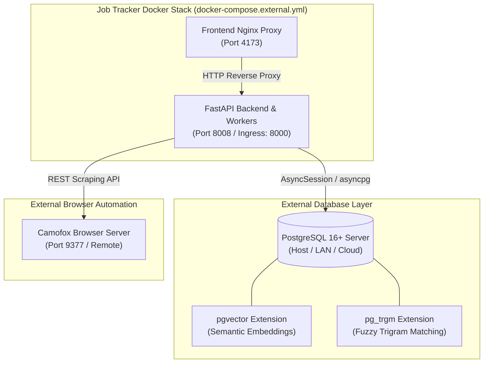

# 🔌 External Services & Custom Infrastructure Guide

Job Tracker is designed with a modular, decoupled architecture. While the default deployment includes bundled Docker containers for **PostgreSQL 16** (with `pgvector` and `pg_trgm`) and the **Camofox Stealth Scraper**, you can seamlessly connect Job Tracker to your own external or host-managed services:

- **External PostgreSQL Database:** Use an existing PostgreSQL 16+ instance running on bare-metal, a home lab server (e.g., Proxmox, TrueNAS, unRAID, Synology), or managed cloud databases (AWS RDS, Supabase, Neon, GCP Cloud SQL, Azure Database for PostgreSQL, Tembo).
- **External Camofox Scraper:** Use a standalone Camofox browser instance hosted on a dedicated scraping node, remote server, or customized container environment.

This guide provides step-by-step instructions for preparing your external services, configuring environment variables, launching with Docker Compose overrides, and troubleshooting cross-platform networking.

---

## 🏗️ Architecture Overview



---

## 🗄️ External PostgreSQL Requirements & Setup

Job Tracker leverages advanced PostgreSQL features for vector similarity search and fast, typo-tolerant text matching.

### 1. Database Version & Extension Requirements
- **PostgreSQL Version:** PostgreSQL **16+** (16 and 17 supported).
- **Required Extensions:**
  - `vector` ([pgvector](https://github.com/pgvector/pgvector)): Used for storing 768- and 1536-dimensional semantic embeddings in `email_application_embeddings` and executing HNSW cosine similarity search.
  - `pg_trgm` (PostgreSQL Trigram Matching): Core PostgreSQL extension used for fuzzy entity resolution and company name matching in `email_companies.name_normalized`.

> [!IMPORTANT]
> Both `vector` and `pg_trgm` extensions must be installed in PostgreSQL and activated on the target database prior to running Job Tracker.

---

### 2. Installing Extensions on External PostgreSQL

#### Ubuntu / Debian (Host / Server)
```bash
# Install PostgreSQL 16 and pgvector
sudo apt update
sudo apt install -y postgresql-16 postgresql-16-pgvector postgresql-contrib
```

#### Arch Linux
```bash
sudo pacman -S postgresql pgvector
```

#### Fedora / RHEL / Rocky Linux
```bash
sudo dnf install -y postgresql16-server pgvector_16
```

#### macOS (Homebrew)
```bash
brew install postgresql@16 pgvector
brew services start postgresql@16
```

#### Docker Container (Self-Hosted pgvector image)
If you already run a standalone database container:
```bash
docker run -d \
  --name my-postgres \
  -e POSTGRES_USER=postgres \
  -e POSTGRES_PASSWORD=your_secure_password \
  -e POSTGRES_DB=job_tracker \
  -p 5432:5432 \
  pgvector/pgvector:pg16
```

---

### 3. Provisioning Database, User, and Extensions

Connect to your PostgreSQL server as superuser (`postgres`) using `psql` or your preferred database administration tool (DBeaver, pgAdmin, DataGrip):

```sql
-- 1. Create dedicated user and database
CREATE USER jobtracker WITH PASSWORD 'your_secure_password_here';
CREATE DATABASE job_tracker OWNER jobtracker;

-- 2. Grant permissions
GRANT ALL PRIVILEGES ON DATABASE job_tracker TO jobtracker;

-- 3. Connect to the new database
\c job_tracker

-- 4. Enable required extensions
CREATE EXTENSION IF NOT EXISTS vector;
CREATE EXTENSION IF NOT EXISTS pg_trgm;

-- 5. Grant schema permissions to the jobtracker user
GRANT ALL ON SCHEMA public TO jobtracker;
```

#### Verifying Extension Installation
Run the following query in your `job_tracker` database to confirm the extensions are active:
```sql
SELECT extname, extversion FROM pg_extension WHERE extname IN ('vector', 'pg_trgm');
```
Expected output:
```text
 extname | extversion 
---------+------------
 pg_trgm | 1.6
 vector  | 0.8.0
(2 rows)
```

---

### 4. Database Schema Migrations
When Job Tracker starts, the backend automatically applies any pending Alembic schema migrations (`alembic upgrade head`) to construct tables, foreign keys, and indexes.

You can also manually apply or verify migrations at any time:
```bash
# Inside the backend container:
docker compose -f docker-compose.yml -f docker-compose.external.yml exec backend uv run alembic upgrade head
```

---

## 🕷️ External Camofox Scraper Setup

Job Tracker uses [Camofox](https://github.com/jo-inc/camofox-browser) for stealth headless browser automation, bypassing Cloudflare/anti-bot screens, expanding truncated job descriptions, and closing cookie consent popups.

### 1. Running Camofox as a Standalone Container
You can run the Camofox scraper on the same host, a separate virtual machine, or a dedicated scraping server:

```bash
docker run -d \
  --name standalone-camofox \
  --restart unless-stopped \
  -p 9377:9377 \
  ghcr.io/jo-inc/camofox-browser:latest
```

### 2. Verifying Scraper Health
Verify the standalone Camofox instance is running:
```bash
curl -f http://localhost:9377/health
# Response: {"status":"healthy"}
```

> [!NOTE]
> **Graceful Scraper Fallback:**
> If the Camofox scraper endpoint is unreachable or disabled, Job Tracker's intake pipeline automatically falls back to direct asynchronous HTTP retrieval with BeautifulSoup HTML parsing.

---

## ⚙️ Environment Configuration (`.env`)

Configure your `.env` file in the root of the Job Tracker repository with your external service credentials.

### Example `.env` for External Services on Host Machine (`host.docker.internal`)
```ini
# ==============================================================================
# Job Tracker - External Services Configuration
# ==============================================================================

# Application Environment
ENVIRONMENT=production
LOG_LEVEL=INFO

# External PostgreSQL Database Settings
POSTGRES_HOST=host.docker.internal
POSTGRES_PORT=5432
POSTGRES_USER=jobtracker
POSTGRES_PASSWORD=your_secure_password_here
POSTGRES_DB=job_tracker

# External Camofox Scraper Endpoint
CAMOUFOX_ENDPOINT=http://host.docker.internal:9377

# Frontend & Backend Port Bindings
FRONTEND_PORT=4173
BACKEND_PORT=8008

# Security & Secrets (auto-generated if left empty)
SECRET_KEY=
ADMIN_SECRET=
PUBLIC_API_URL=
PUBLIC_FRONTEND_URL=http://localhost:4173
```

### Example `.env` for Remote / Cloud Database (e.g. AWS RDS, Supabase, LAN Server)
```ini
# Remote Database on Private LAN or Cloud
POSTGRES_HOST=192.168.1.150
POSTGRES_PORT=5432
POSTGRES_USER=jobtracker
POSTGRES_PASSWORD=your_cloud_database_password
POSTGRES_DB=job_tracker

# Remote or Host-Managed Camofox
CAMOUFOX_ENDPOINT=http://192.168.1.150:9377
```

### Configuration Parameters Reference

| Variable | Default Value | Description |
| :--- | :--- | :--- |
| `POSTGRES_HOST` | `host.docker.internal` | Hostname, domain, or IP of the external PostgreSQL instance. |
| `POSTGRES_PORT` | `5432` | Port on which the external PostgreSQL server listens. |
| `POSTGRES_USER` | `postgres` | Username for database authentication. |
| `POSTGRES_PASSWORD` | `postgres` | Password for database authentication. |
| `POSTGRES_DB` | `postgres` | Target database name containing `vector` and `pg_trgm` extensions. |
| `CAMOUFOX_ENDPOINT` | `http://host.docker.internal:9377` | Full HTTP URL to the Camofox browser server. |
| `FRONTEND_PORT` | `4173` | Host port mapped to the web UI and reverse proxy. |
| `BACKEND_PORT` | `8008` | Host port mapped to the FastAPI backend API. |
| `SECRET_KEY` | *(Auto-generated)* | 32-byte Fernet key used to encrypt AI provider credentials at rest. |

---

## 🚀 Launching with External Services

Job Tracker provides a dedicated Docker Compose override file: `docker-compose.external.yml`. This override disables the internal `db` and `scraper` containers, clears backend dependencies, and routes database and scraper traffic to your configured endpoints.

### 1. Start Job Tracker
```bash
docker compose -f docker-compose.yml -f docker-compose.external.yml up -d
```

### 2. Follow Logs to Confirm Healthy Startup
```bash
docker compose -f docker-compose.yml -f docker-compose.external.yml logs -f backend
```
Look for the startup log indicating successful database connectivity and migration execution:
```text
INFO: Database connection established.
INFO: Running database schema migrations...
INFO: Application startup complete.
```

### 3. Check Container Status
```bash
docker compose -f docker-compose.yml -f docker-compose.external.yml ps
```
Only `job-tracker-backend` and `job-tracker-frontend` will be running. The internal `db` and `scraper` containers remain disabled.

### 4. Stop Services
```bash
docker compose -f docker-compose.yml -f docker-compose.external.yml down
```

---

## 🌐 Networking Deep Dive: Connecting to the Host Machine

When Job Tracker runs inside Docker containers and your PostgreSQL or Camofox instances run directly on the host machine, you cannot connect to `localhost` or `127.0.0.1` because `localhost` refers to the container itself.

```
┌────────────────────────────────────────────────────────────┐
│ Host Machine                                               │
│   ├── PostgreSQL (Port 5432)                               │
│   └── Camofox Scraper (Port 9377)                          │
│                                                            │
│   ┌────────────────────────────────────────────────────┐   │
│   │ Docker Network (job_tracker_network)               │   │
│   │   ├── Backend Container                            │   │
│   │   │     Connects to host.docker.internal ──────────┼───┤
│   │   └── Frontend Container                           │   │
│   └────────────────────────────────────────────────────┘   │
└────────────────────────────────────────────────────────────┘
```

### 1. `host.docker.internal` Behavior by OS
- **Linux:** `docker-compose.yml` and `docker-compose.external.yml` configure `extra_hosts: ["host.docker.internal:host-gateway"]`. This automatically maps `host.docker.internal` to the host's `docker0` bridge gateway IP (typically `172.17.0.1`).
- **macOS & Windows (Docker Desktop):** `host.docker.internal` is built into Docker Desktop and resolves directly to the host system.

---

## 🔒 PostgreSQL Host Access & Security Configuration

If your PostgreSQL database is running directly on the host machine (not in Docker), you must configure PostgreSQL to accept connections from the Docker container network.

### 1. Enable Listening on Network Interfaces (`postgresql.conf`)
Open your `postgresql.conf` file:
- **Linux:** `/etc/postgresql/16/main/postgresql.conf`
- **macOS (Homebrew):** `/opt/homebrew/var/postgresql@16/postgresql.conf`

Ensure PostgreSQL listens on the Docker interface or all interfaces:
```ini
listen_addresses = '*'
```

### 2. Configure Client Authentication (`pg_hba.conf`)
Open your `pg_hba.conf` file (in the same directory as `postgresql.conf`).

Add a rule granting access to the Docker subnet (default Docker bridge is `172.17.0.0/16` or `172.16.0.0/12`):
```ini
# TYPE  DATABASE        USER            ADDRESS                 METHOD
host    job_tracker     jobtracker      172.16.0.0/12           scram-sha-256
host    job_tracker     jobtracker      127.0.0.1/32            scram-sha-256
host    job_tracker     jobtracker      ::1/128                 scram-sha-256
```

### 3. Reload PostgreSQL Configuration
Apply the configuration changes without restarting PostgreSQL:
```bash
# Linux
sudo systemctl reload postgresql

# macOS
brew services restart postgresql@16

# SQL query (from psql superuser session)
SELECT pg_reload_conf();
```

---

## 🛠️ Cross-Platform Troubleshooting & Diagnostics

### 1. Error: `connection to server at "host.docker.internal", port 5432 failed: Connection refused`

#### Linux (UFW Firewall Blocking Docker Subnet)
UFW by default may block incoming connections from the Docker bridge interface to the host:
```bash
# Check Docker bridge interface name (usually docker0 or br-...)
ip addr show docker0

# Allow traffic from Docker bridge to PostgreSQL port 5432
sudo ufw allow in on docker0 to any port 5432 proto tcp

# Allow traffic from Docker bridge to Camofox port 9377
sudo ufw allow in on docker0 to any port 9377 proto tcp

# Reload firewall
sudo ufw reload
```

#### Windows WSL2 (Windows Firewall)
If running PostgreSQL on Windows host while Docker runs in WSL2:
1. Open **Windows Defender Firewall with Advanced Security**.
2. Create an **Inbound Rule** for TCP port `5432` allowing connections from private networks.
3. If `host.docker.internal` fails to resolve in WSL2, set `POSTGRES_HOST` in `.env` to your Windows host LAN IP (find with `ipconfig`).

#### macOS (Application Firewall)
If macOS prompts with *"Do you want the application 'postgres' to accept incoming network connections?"*, click **Allow**. Ensure the firewall does not block incoming connections to port `5432` in **System Settings** ➜ **Network** ➜ **Firewall**.

---

### 2. Error: `type "vector" does not exist` or `type "vector_768" does not exist`
- **Cause:** The `pgvector` extension was not enabled in the database before Job Tracker executed migrations.
- **Solution:** Connect to your database and run:
  ```sql
  \c job_tracker
  CREATE EXTENSION IF NOT EXISTS vector;
  ```

---

### 3. Testing Network Connectivity from Inside the Container
To verify that the Job Tracker backend container can reach your external database and scraper:

```bash
# 1. Test PostgreSQL connectivity from backend container
docker compose -f docker-compose.yml -f docker-compose.external.yml exec backend \
  python -c "import socket; s = socket.socket(); s.settimeout(3); s.connect(('host.docker.internal', 5432)); print('✅ PostgreSQL reachable!'); s.close()"

# 2. Test Camofox Scraper endpoint from backend container
docker compose -f docker-compose.yml -f docker-compose.external.yml exec backend \
  curl -I http://host.docker.internal:9377/health
```

---

## 📚 Related Documentation

- [System Architecture](file:///home/joel/Projects/job-tracker/docs/ARCHITECTURE.md) — Comprehensive architecture, LangGraph state machines, and data models.
- [AI Providers Setup](file:///home/joel/Projects/job-tracker/docs/AI_PROVIDERS.md) — Configuring local LLMs (LM Studio, Ollama) and cloud providers (OpenAI, Claude, Gemini).
- [Quickstart & Daily Driving Guide](file:///home/joel/Projects/job-tracker/docs/QUICKSTART.md) — In-app onboarding wizard, daily CLI commands, and companion browser extension.
