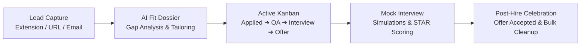
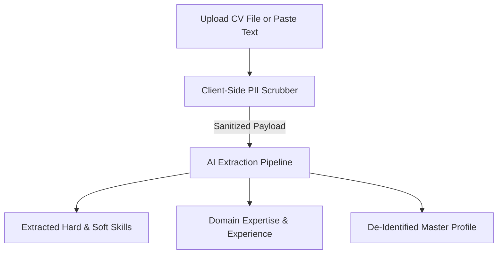
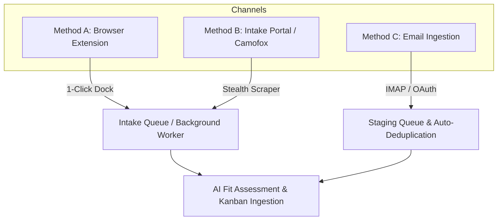
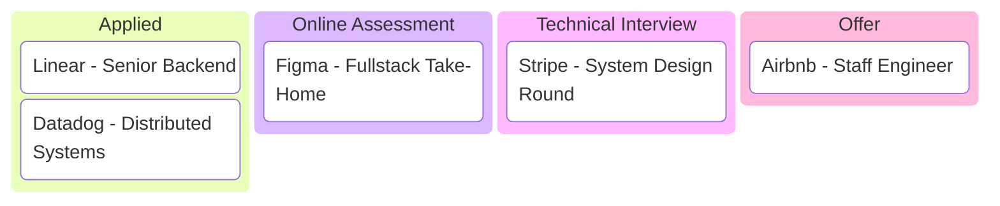
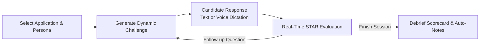

# 🧭 Job Tracker User Guide: The Complete Workflow Manual

Welcome to **Job Tracker**, your comprehensive, AI-orchestrated recruitment command center. Job Tracker is engineered to transform the chaotic job search into a structured, data-driven pipeline. By combining stealth web scraping, client-side privacy protection, multi-provider LLM intelligence, interactive mock interview simulations, and Kanban pipeline tracking, Job Tracker empowers you to apply smarter, interview better, and land your ideal role.

---

## 📑 Table of Contents

1. [Introduction & Core Concepts](#1-introduction--core-concepts)
   - [The 5-Stage Recruitment Lifecycle](#the-5-stage-recruitment-lifecycle)
   - [Core Architecture & Entity Glossary](#core-architecture--entity-glossary)
2. [Workflow 1: Setting Up Your Candidate Profile](#2-workflow-1-setting-up-your-candidate-profile)
   - [Resume Ingestion (PDF, DOCX, TXT)](#resume-ingestion-pdf-docx-txt)
   - [Client-Side Zero-Knowledge PII Scrubber](#client-side-zero-knowledge-pii-scrubber)
   - [AI Skill & Experience Extraction](#ai-skill--experience-extraction)
3. [Workflow 2: Ingesting Job Postings (3 Channels)](#3-workflow-2-ingesting-job-postings-3-channels)
   - [Method A: 1-Click Companion Browser Extension](#method-a-1-click-companion-browser-extension)
   - [Method B: Job Intake Portal (Camofox Stealth Scraper & Raw Text)](#method-b-job-intake-portal-camofox-stealth-scraper--raw-text)
   - [Method C: Automated Recruitment Email Sync](#method-c-automated-recruitment-email-sync)
4. [Workflow 3: AI Fit Dossier & Gap Analysis](#4-workflow-3-ai-fit-dossier--gap-analysis)
   - [Understanding the AI Fit Score (0–100%)](#understanding-the-ai-fit-score-0100)
   - [Deep Dive Gap Analysis & Tailoring Strategy](#deep-dive-gap-analysis--tailoring-strategy)
   - [AI-Tailored Cover Letter Generator](#ai-tailored-cover-letter-generator)
5. [Workflow 4: Kanban Applications Pipeline & Lifecycle](#5-workflow-4-kanban-applications-pipeline--lifecycle)
   - [Active Pipeline Stages vs. Terminal States](#active-pipeline-stages-vs-terminal-states)
   - [Chronological Sorting & Urgency Signals](#chronological-sorting--urgency-signals)
   - [Application Detail Drawer & Activity Log](#application-detail-drawer--activity-log)
   - [Automated Action Items To-Do Hub](#automated-action-items-to-do-hub)
   - [Automated Staleness Archiver](#automated-staleness-archiver)
   - [Post-Hire Celebration & Bulk Transitions](#post-hire-celebration--bulk-transitions)
6. [Workflow 5: Interactive Mock Interview Simulator](#6-workflow-5-interactive-mock-interview-simulator)
   - [Choosing Your Interviewer Persona](#choosing-your-interviewer-persona)
   - [Selecting Challenge Modes (Conversational, MCQ, Hybrid)](#selecting-challenge-modes-conversational-mcq-hybrid)
   - [Real-Time Practice: Voice Transcription & STAR Rubrics](#real-time-practice-voice-transcription--star-rubrics)
   - [Post-Session Debrief Scorecard & Auto-Notes](#post-session-debrief-scorecard--auto-notes)
7. [Workflow 6: Analytics, Staging Triage & Diagnostics](#7-workflow-6-analytics-staging-triage--diagnostics)
   - [Market Intelligence & Funnel Analytics](#market-intelligence--funnel-analytics)
   - [Staging Queue Triage & 2-Step Resolution Wizard](#staging-queue-triage--2-step-resolution-wizard)
   - [Diagnostics & Telemetry Tracing (`/diagnostics`)](#diagnostics--telemetry-tracing-diagnostics)
8. [Quick Reference & Keyboard Shortcuts](#8-quick-reference--keyboard-shortcuts)

---

## 1. Introduction & Core Concepts

Job Tracker is designed around a continuous, closed-loop recruitment lifecycle. Rather than treating job hunting as a disconnected set of bookmarks, emails, and notes, Job Tracker unifies every touchpoint into an intelligent state machine.



### The 5-Stage Recruitment Lifecycle

1. **Lead Capture & Ingestion**: Capture job postings seamlessly from browser tabs (LinkedIn, Indeed, Greenhouse, Lever, Workday, Ashby), paste job URLs to trigger stealth browser rendering, or auto-fetch incoming recruitment emails.
2. **AI Fit Qualification & Gap Analysis**: Match your candidate profile against job descriptions to extract required skills, calculate fit scores (0–100%), surface keyword gaps, and generate customized cover letters.
3. **Active Pipeline Tracking (Kanban)**: Track applications across active stages (`APPLIED`, `ONLINE_ASSESSMENT`, `TECHNICAL_INTERVIEW`, `OFFER`) with automatic chronological deadline sorting and background staleness archiving.
4. **Interactive Mock Interview Prep**: Launch targeted interview simulations powered by specialized AI personas (Bar Raiser, Hiring Manager, Behavioral Coach), complete with speech-to-text voice dictation and real-time STAR evaluation.
5. **Offer & Celebration**: Accept your chosen offer with celebratory fanfare and execute bulk transitions to automatically withdraw or archive other open applications.

---

### Core Architecture & Entity Glossary

| Entity / Concept | Description |
| :--- | :--- |
| **Candidate Profile (`CandidateCVModel`)** | Your master resume data, anonymized text, extracted technical skills, core competencies, and verified domain experience. |
| **Application (`ApplicationModel`)** | A tracked position at a company, maintaining status, interview guides, match dossiers, notes, and activity history. |
| **Company (`CompanyModel`)** | Canonical company records indexed with normalized fuzzy-matching names and validated domains for crisp logo/favicon resolution. |
| **Timeline Event (`ApplicationEventModel`)** | Structured recruitment history (emails, logged calls, scheduled interview rounds) bound to an application. |
| **Action Item (`ActionItemModel`)** | High-urgency to-do tasks with due dates extracted automatically from recruitment emails or created manually. |
| **Staging Item (`StagingItemModel`)** | Ambiguous or low-confidence inbound leads/emails staged for manual 2-step resolution before entering the pipeline. |
| **Interview Session (`InterviewSessionModel`)** | Multi-turn mock interview simulations with turn transcripts, persona parameters, STAR feedback, and debrief scorecards. |
| **Telemetry Trace (`TraceEventModel`)** | Diagnostic execution logs capturing latencies, token consumption, prompts, network requests, and errors. |

---

## 2. Workflow 1: Setting Up Your Candidate Profile

Your Candidate Profile forms the baseline for all AI fit assessments, gap analyses, interview simulations, and tailored cover letters.



### Resume Ingestion (PDF, DOCX, TXT)

1. Navigate to **Candidate Profile** in the main navigation sidebar (or trigger the **Onboarding Wizard** on first launch).
2. Choose your input method:
   - **File Upload**: Drag and drop your existing resume (`.pdf`, `.docx`, `.txt`). The text is parsed directly in your browser.
   - **Direct Paste**: Paste your raw resume or LinkedIn profile summary into the markdown editor.

---

### Client-Side Zero-Knowledge PII Scrubber

Privacy is paramount when using cloud or remote AI providers. Job Tracker includes a **100% Client-Side Programmatic PII Scrubber** that redacts personally identifiable information before any network packet is dispatched.

> [!IMPORTANT]
> Redaction occurs entirely inside your browser's JavaScript runtime before the request hits the API or LLM.

#### Redaction Rules & Patterns:
- **Full Legal Names**: Identifies candidate header lines and converts them to `[Candidate Name]`.
- **Email Addresses**: Replaces matching RFC-compliant email strings with `[Email Redacted]`.
- **Phone Numbers**: Normalizes international and domestic phone formats (7 to 15 digits) to `[Phone Redacted]`.
- **Street Addresses & Locations**: Identifies street names, avenues, boulevards, zip codes, and postal prefixes, replacing them with `[Address Redacted]`.
- **Personal URLs**: Replaces personal LinkedIn, GitHub, and portfolio links with `[Profile Link Redacted]`.

```
Original:
Joel Duarte — Staff Systems Engineer
Email: joel.duarte@example.com | Phone: +1 (555) 019-2834
Location: 742 Evergreen Terrace, Springfield, OR 97477
LinkedIn: https://linkedin.com/in/joelduarte

Scrubbed Output:
[Candidate Name] — Staff Systems Engineer
Email: [Email Redacted] | Phone: [Phone Redacted]
Location: [Address Redacted]
LinkedIn: [Profile Link Redacted]
```

You can view live **Redaction Metrics** (showing the count of redacted emails, phones, URLs, and addresses) and preview the anonymized text before clicking **Save Profile**.

---

### AI Skill & Experience Extraction

Once submitted, Job Tracker runs the candidate extraction graph to populate your profile dossier:

- **Technical Hard Skills**: Programming languages, distributed system architectures, databases, cloud platforms, and tooling (e.g., `Python`, `Go`, `PostgreSQL`, `pgvector`, `Kubernetes`, `Kafka`).
- **Core Competencies**: High-level engineering abilities (e.g., `Distributed Systems Architecture`, `High-Throughput ETL Pipelines`, `Cross-Functional Leadership`).
- **Domain Experience**: Verified experience across specific verticals (e.g., `FinTech / Payments`, `Observability & APM`, `Cloud Infrastructure`).
- **Calibrated Years of Experience**: Accurately calculated total professional experience based on your career timeline.

> [!TIP]
> You can manually add, edit, or remove skill tags at any time to fine-tune future AI assessments.

---

## 3. Workflow 2: Ingesting Job Postings (3 Channels)

Job Tracker provides three flexible ingestion channels suited for different browsing and application workflows.



---

### Method A: 1-Click Companion Browser Extension

The **Job Tracker Companion** extension mounts directly into your web browser, giving you instant 1-click capture while browsing job boards.

#### Supported Browsers:
- **Chromium**: Google Chrome, Brave, Microsoft Edge, Arc
- **Gecko**: Mozilla Firefox

#### Installation:
1. Open your browser's extension manager (`chrome://extensions` or `about:debugging#/runtime/this-firefox`).
2. Enable **Developer Mode**.
3. Click **Load unpacked** (or **Load Temporary Add-on** in Firefox) and select the `extension/` directory.
4. Set your backend URL in the extension popup settings (defaults to `http://localhost:8000`).

#### Floating In-Page Dock
When browsing recognized job postings, a floating action dock appears in the bottom corner of your screen:

```
┌─────────────────────────────────────────────────────────┐
│ 💼 Staff Distributed Systems Engineer · Stripe          │
│ ─────────────────────────────────────────────────────── │
│ [ ⚡ Enqueue AI Assessment ]   [ 🎯 Direct Applied ]     │
└─────────────────────────────────────────────────────────┘
```

- **⚡ Enqueue AI Assessment**: Dispatches the job URL and DOM content to the backend evaluation worker. The AI parses the job description, compares it against your candidate profile, and notifies you when ready.
- **🎯 Direct Applied**: For jobs you have already submitted. Instantly creates an active application card in the `APPLIED` Kanban stage.

#### Supported Job Portals (Optimized Selectors):
- **LinkedIn Jobs** (`linkedin.com/jobs/*`)
- **Indeed** (`indeed.com/viewjob*`, `indeed.com/jobs*`)
- **Glassdoor** (`glassdoor.com/job-listing/*`)
- **Greenhouse** (`boards.greenhouse.io/*`, `job-boards.greenhouse.io/*`)
- **Lever** (`jobs.lever.co/*`)
- **Workday** (`*.myworkdayjobs.com/*`)
- **Ashby** (`jobs.ashbyhq.com/*`)
- **Universal Smart Fallback**: Automatically extracts job title, company, and body content from arbitrary custom company career portals.

---

### Method B: Job Intake Portal (Camofox Stealth Scraper & Raw Text)

Navigate to **Job Intake** (`/intake`) or trigger the **Global Quick Ingest Modal** (`Cmd/Ctrl + K`).

```
┌─────────────────────────────────────────────────────────┐
│ 📥 Job Intake & Assessment Engine                       │
│ ─────────────────────────────────────────────────────── │
│ URL Mode: [ https://boards.greenhouse.io/stripe/jobs/..]│
│                                                         │
│ [x] Enable Stealth Browser Render (Camofox)             │
│ [x] Auto-generate Tailored Cover Letter                 │
│                                                         │
│ [ 🚀 Run AI Fit Assessment ]   [ 📋 Add as Applied ]   │
└─────────────────────────────────────────────────────────┘
```

#### Camofox Stealth Scraper Features:
- **Anti-Bot & Cloudflare Bypass**: Emulates realistic browser environments to prevent CAPTCHAs and bot blocks.
- **Automated Cookie Banner Dismissal**: Automatically closes GDPR and consent overlays.
- **Dynamic Content Expansion**: Clicks "Show More", "Read Full Description", and accordion tabs to extract 100% of the job posting text.
- **Raw Text Mode**: If a job posting is behind an internal intranet or login wall, switch to **Raw Text Mode** and paste the text directly.

---

### Method C: Automated Recruitment Email Sync

Job Tracker connects directly to your recruitment email accounts to track inbound applications, interview invites, and status updates.

#### Supported Connection Types:
1. **IMAP (SSL / TLS)**: Connect standard email providers with host, port, username, and app password.
2. **Google Gmail (OAuth2)**: Seamless 1-click Google authentication with automatic token refresh.
3. **Microsoft Graph (Office 365 / Outlook)**: Enterprise OAuth2 integration for Microsoft accounts.

#### Automatic Parsing & Deduplication:
- **Message-ID Deduplication**: Every email is uniquely tracked using RFC 822 `Message-ID` headers to prevent duplicates.
- **Conversation Threading**: Ongoing recruiter email threads are linked directly to the corresponding application's chronological event timeline.
- **Status Progression**: AI extracts intent from email bodies (e.g., "We'd love to schedule a technical round" transitions the application to `TECHNICAL_INTERVIEW`).

> [!TIP]
> For a full walkthrough on setting up OAuth 2.0 apps in Google Cloud / Azure or generating 16-character App Passwords for iCloud, Fastmail, Yahoo, and Zoho, check the [OAuth & Mailbox Setup Guide](file:///home/joel/Projects/job-tracker/docs/OAUTH_SETUP.md).

---

## 4. Workflow 3: AI Fit Dossier & Gap Analysis

The **AI Fit Dossier** is an in-depth audit of how your background aligns with a specific role. Access your evaluations in the **Assessments** view (`/assessments`).

```
┌──────────────────────────────────────────────────────────────────────┐
│  Stripe — Staff Distributed Systems Engineer                         │
│  Match Score: 92%  |  Recommendation: APPLY_STRONGLY                 │
│ ──────────────────────────────────────────────────────────────────── │
│  ✅ 8/9 Core Hard Skills Found       ⚠️ 1 Terminology Delta          │
│  • Go, Distributed Systems, Raft    • Missing: "eBPF Kernel Tracing" │
│  • High-Throughput gRPC, Postgres   • Experience: 10+ yrs (Matches)  │
│ ──────────────────────────────────────────────────────────────────── │
│  [ 📄 View Full Audit ] [ ✍️ Tailor Cover Letter ] [ ➡️ Push to Board]│
└──────────────────────────────────────────────────────────────────────┘
```

---

### Understanding the AI Fit Score (0–100%)

The AI Fit Score is a composite, weighted evaluation based on multiple dimensions:

| Score Range | Recommendation | Strategic Meaning |
| :--- | :--- | :--- |
| **85% – 100%** | `APPLY_STRONGLY` | Exceptional alignment. You meet all mandatory skills and seniority expectations. Priority application. |
| **70% – 84%** | `APPLY` | Strong candidate. Solid core overlap with a few minor keyword or domain differences that can be addressed in your resume. |
| **50% – 69%** | `CAUTION` | Moderate fit. Key skill gaps or seniority mismatches exist. Requires significant resume tailoring. |
| **0% – 49%** | `SKIP` | Significant divergence from requirements. Application not recommended unless transitioning specialties. |

---

### Deep Dive Gap Analysis & Tailoring Strategy

Clicking on any assessment card opens the **Match Analysis Modal**:

1. **Core Hard Skills Match**: Shows exact keyword hits between your CV and the JD (e.g., *Kubernetes*, *PostgreSQL*, *Distributed Consensus*).
2. **Terminology Deltas & Optimization Gaps**: Identifies semantic equivalents where you have the underlying skill but used different terminology (e.g., you wrote "Async Task Queue" while the JD specifies "Celery / Redis Streams").
3. **Seniority & Experience Delta**: Evaluates whether your years of experience, leadership scope, and architectural ownership match the job's level.
4. **Pros & Cons Matrix**: Highlights standout benefits (e.g., competitive salary, modern stack, remote flexibility) alongside potential caveats (e.g., on-call rotation, legacy migrations).
5. **Resume Tailoring Recommendations**: Provides concrete, actionable rewrites for your CV bullet points to emphasize relevant projects and keywords.

---

### AI-Tailored Cover Letter Generator

Generate customized, highly persuasive cover letters tuned to the specific role and company culture.

```
┌─────────────────────────────────────────────────────────┐
│ ✍️ Tailored Cover Letter Generator                      │
│ ─────────────────────────────────────────────────────── │
│ Tone:   [ Professional & Confident ▾ ]                  │
│ Length: [ Standard (~300 words)   ▾ ]                  │
│                                                         │
│ Custom Instructions:                                    │
│ [ Emphasize my experience leading Raft consensus work. ]│
│                                                         │
│ [ ⚡ Generate Letter ]    [ 📋 Copy to Clipboard ]      │
└─────────────────────────────────────────────────────────┘
```

#### Available Customization Options:
- **Tones**:
  - `Professional & Confident` (Default, polished executive tone)
  - `Enthusiastic & Passionate` (High-energy startup culture)
  - `Concise & Direct` (Short, bulleted, no fluff)
  - `Executive Leadership` (Focus on strategy, ROI, and team building)
  - `Technical & Systems Focused` (Deep dive on architectures and metrics)
- **Lengths**:
  - `Concise (~150 words)`
  - `Standard (~300 words)`
  - `Detailed (~450 words)`
- **Auto-Save & Markdown Preview**: Edit the letter directly in the built-in rich editor with character/word counters and 1-click clipboard copying.

---

## 5. Workflow 4: Kanban Applications Pipeline & Lifecycle

The **Applications Kanban Board** (`/applications`) serves as your primary day-to-day command center.



### Active Pipeline Stages vs. Terminal States

The board is organized into **4 Active Pipeline Stages** and **4 Terminal States**:

```
Active Stages (Drag & Drop):
┌──────────────┐   ┌───────────────────┐   ┌───────────────────────┐   ┌─────────────┐
│ 1. APPLIED   │ ➔ │ 2. OA / SCREENING │ ➔ │ 3. TECH INTERVIEW     │ ➔ │ 4. OFFER    │
└──────────────┘   └───────────────────┘   └───────────────────────┘   └─────────────┘

Terminal States (Archived / Settled):
• HIRED       (Offer accepted — triggers celebration)
• ARCHIVED    (Stale or manually archived)
• WITHDRAWN   (Candidate withdrew)
• REJECTED    (Company declined)
```

---

### Chronological Sorting & Urgency Signals

Job Tracker automatically surfaces high-priority cards at the top of each column:

- **Upcoming Interview Countdowns**: Applications in `TECHNICAL_INTERVIEW` with scheduled rounds are sorted chronologically with live countdown badges (e.g., *"Interview in 2 days"*).
- **Offer Expiration Deadlines**: Applications in `OFFER` are sorted by decision deadline (e.g., *"Offer expires in 48 hours"*).
- **Action Required Badges**: Cards with pending to-dos (e.g., take-home assessments, scheduling links) display an orange pulse indicator.

---

### Application Detail Drawer & Activity Log

Clicking any card slides out the **Application Detail Drawer**:

- **Company Intelligence**: Direct links, verified company domain, and high-res favicon.
- **Unified Timeline**: Complete chronological history of recruitment emails, status transitions, and interview rounds.
- **Log Activity Modal**: Manually log phone screens, recruiter check-ins, or custom notes with date-time pickers.
- **Interview Guide**: Download or print a structured AI-generated interview prep packet with company-specific questions and technical review topics.

---

### Automated Action Items To-Do Hub

The **Action Items** view (`/actions`) aggregates all pending to-dos across your entire pipeline:

- **Automatic Extraction**: Scans inbound emails for explicit deadlines (e.g., *"Please submit your coding challenge by Friday 5 PM"*).
- **Urgency Classification**: Categorized into `HIGH`, `MEDIUM`, and `LOW` urgency based on due dates and email phrasing.
- **Action URLs**: Direct links to scheduling calendars (Calendly, GoodTime, Greenhouse) or coding assessment portals (HackerRank, Byteboard, Codility).

---

### Automated Staleness Archiver

To keep your Kanban board clutter-free, Job Tracker includes an **Automated Staleness Sweeper**:

> [!NOTE]
> The archiver periodically checks active applications (`APPLIED`, `ONLINE_ASSESSMENT`, `TECHNICAL_INTERVIEW`, `OFFER`). If an application has had no activity or email updates for a configurable duration (default: 30 days), it is moved to `ARCHIVED`.
> 
> Staleness transitions are **non-destructive** (they are never marked as `REJECTED`) and can be restored to the active board with a single click.

---

### Post-Hire Celebration & Bulk Transitions

When you accept an offer, drag the card to **HIRED** or click **Mark as Hired**. This triggers the celebratory **Post-Hire Modal**:

```
┌─────────────────────────────────────────────────────────┐
│ 🎉 You got the job!                                     │
│ Congratulations! What would you like to do with your    │
│ other open applications?                                │
│ ─────────────────────────────────────────────────────── │
│ [x] Archive early-stage applications                    │
│     (Moves Applied and Assessment cards to Archived)    │
│                                                         │
│ [x] Withdraw outstanding interviews & offers            │
│     (Marks Interview and Offer cards as Withdrawn)      │
│                                                         │
│ [ Decide Later ]               [ 🚀 Confirm Cleanup ]   │
└─────────────────────────────────────────────────────────┘
```

#### Bulk Operations Performed:
1. Transitions all remaining active applications to `WITHDRAWN` or `ARCHIVED`.
2. Automatically logs a timeline event (*"Withdrawn — accepted offer at [Company]"*).
3. Dismisses all associated pending Action Items.

---

## 6. Workflow 5: Interactive Mock Interview Simulator

The **Mock Interview Simulator** (`/agent-chat` in Interview Mode) provides live, interactive practice sessions tailored to specific job postings and candidate profiles.



---

### Choosing Your Interviewer Persona

Select from four specialized AI interviewer personalities:

| Persona | Focus Areas | Tone & Scrutiny |
| :--- | :--- | :--- |
| 🛡️ **Technical Bar Raiser** | System design, concurrency, edge cases, failure modes, performance bottlenecks. | Rigorous, precise, demanding architectural clarity. |
| 💼 **Hiring Manager** | Project ownership, team leadership, cross-functional conflict, engineering delivery. | Pragmatic, results-oriented, leadership-focused. |
| 👥 **Behavioral & Culture** | Team collaboration, ethics, resilience, customer obsession, STAR structure. | Attentive, professional, culture-aligned. |
| 🎓 **Supportive Coach** | Answer structuring, identifying missing STAR components, providing exemplar rewrites. | Warm, encouraging, educational. |

---

### Selecting Challenge Modes (Conversational, MCQ, Hybrid)

- 💬 **Conversational Mode (`TEXT_CONVERSATIONAL`)**: Realistic open-ended technical and behavioral interviews with multi-turn follow-ups.
- 🎯 **Multiple Choice Mode (`MULTIPLE_CHOICE`)**: Scenario-based trade-off questions with instant analysis of selected options.
- 🔀 **Hybrid Mode (`HYBRID`)**: Alternates dynamically between objective trade-off challenges and deep-dive conversational questions.

---

### Real-Time Practice: Voice Transcription & STAR Rubrics

- **Speech-to-Text Voice Dictation**: Click the **Microphone** button to dictate answers hands-free using your browser's native Web Speech API.
- **Real-Time STAR Rubric Analysis**: Evaluates every response against the STAR framework:
  - **Situation**: Context, constraints, and baseline setup.
  - **Task**: The specific engineering challenge or responsibility.
  - **Action**: Detailed individual contributions, technical decisions, and trade-offs.
  - **Result**: Measurable impact, latency reductions, ROI, and lessons learned.

```
┌─────────────────────────────────────────────────────────┐
│ 📊 Turn Feedback: Technical Bar Raiser                  │
│ Score: 8.5 / 10                                         │
│ ─────────────────────────────────────────────────────── │
│ • Strengths: Strong explanation of Raft log compaction. │
│ • Missing: Did not address network partition behavior. │
│ • Follow-up: "How would your cluster handle split-brain?│
└─────────────────────────────────────────────────────────┘
```

---

### Post-Session Debrief Scorecard & Auto-Notes

When completing a simulation, the AI generates a comprehensive **Debrief Scorecard**:

- **Overall Readiness Rating**: `HIGHLY_RECOMMENDED`, `RECOMMENDED`, `BORDERLINE`, or `NEEDS_PRACTICE`.
- **Numerical Score**: Calibrated 0–100 overall performance index.
- **Category Scores**: Detailed breakdown for Problem Solving, Technical Depth, Communication, and Behavioral Alignment.
- **Automatic Timeline Persistence**: The scorecard summary is saved directly to the application's timeline events and internal notes for easy review before your actual interview.

---

## 7. Workflow 6: Analytics, Staging Triage & Diagnostics

### Market Intelligence & Funnel Analytics

Navigate to **Analytics** (`/analytics`) to review your job search metrics:

```
┌──────────────────────────────────────────────────────────────────────┐
│ 📊 Recruitment Pipeline Performance                                  │
│ ──────────────────────────────────────────────────────────────────── │
│  Total Applications: 42   |  Interview Rate: 38.1%  |  Offer Rate: 7.1%│
│  Avg Fit Score: 84%       |  Pipeline Velocity: 14.2 days / stage    │
│ ──────────────────────────────────────────────────────────────────── │
│  Funnel Conversion: Applied ➔ OA (62%) ➔ Interview (45%) ➔ Offer (20%)│
│  Top In-Demand Skills: Go, Kubernetes, PostgreSQL, gRPC, Kafka       │
└──────────────────────────────────────────────────────────────────────┘
```

- **Pipeline Funnel**: Measure conversion and drop-off rates between stages.
- **Skill In-Demand Heatmap**: Identify which technologies in your target market yield the highest interview conversion rates.
- **Salary Benchmarks**: Compare salary ranges across tracked applications by role and work model (Remote, Hybrid, On-site).

---

### Staging Queue Triage & 2-Step Resolution Wizard

When an email or webhook arrives with ambiguous company or position information, it is placed in the **Staging Queue** (`/staging`) to prevent data corruption.

#### 2-Step Resolution Wizard:
1. **Step 1 — Target Selection**:
   - **Link to Existing Application**: Attach the event to an already tracked application.
   - **Create New Application**: Spin up a new company and application entity.
2. **Step 2 — Configure Details**:
   - Review and edit extracted metadata (company name, role, salary, required action items, and due dates).
   - Click **Approve & Ingest** to merge the lead into your active pipeline.

---

### Diagnostics & Telemetry Tracing (`/diagnostics`)

Job Tracker includes end-to-end telemetry for monitoring all background operations:

```
┌──────────────────────────────────────────────────────────────────────┐
│ 🩺 Diagnostics & Telemetry Dashboard                                 │
│ ──────────────────────────────────────────────────────────────────── │
│ [ All Telemetry ] [ AI & LLM ] [ Web Scraper ] [ Email Sync ] [ Workers ]│
│                                                                      │
│ • [LLM]     intake_assessment_evaluation    | Duration: 1.42s | ✅ OK│
│ • [Scraper] camofox_fetch_job_description   | Duration: 2.10s | ✅ OK│
│ • [Email]   imap_sync_inbox                 | Duration: 0.85s | ✅ OK│
└──────────────────────────────────────────────────────────────────────┘
```

- **Filter by Category**: `llm`, `scraper`, `email_sync`, `worker`, `embedding`.
- **Inspect Execution Traces**: View full input prompts, raw LLM completions, token counts, network payloads, and error tracebacks.
- **Retry Failed Jobs**: Re-run failed scrapers or LLM evaluations directly from the trace inspector.

---

## 8. Quick Reference & Keyboard Shortcuts

### Global Keyboard Shortcuts

| Shortcut | Action |
| :--- | :--- |
| `Cmd / Ctrl + K` | Open Quick Ingest Modal |
| `Cmd / Ctrl + /` | Toggle Main Navigation Sidebar |
| `Esc` | Close Active Drawer / Modal |
| `Enter` (in Chat/Input) | Send Message / Submit Form |
| `Shift + Enter` | Insert Line Break in Multiline Inputs |
| `Space` / `Enter` (on Checkbox Cards) | Toggle Card Selection |

### Application Status Lifecycle Reference

| Status Code | Stage Type | Description |
| :--- | :--- | :--- |
| `APPLIED` | Active | Initial application submitted; awaiting company response. |
| `ONLINE_ASSESSMENT` | Active | Take-home assignment, screening questionnaire, or automated coding test in progress. |
| `TECHNICAL_INTERVIEW`| Active | Recruiter screens, technical rounds, system design, or onsite interviews scheduled. |
| `OFFER` | Active | Formal offer received; negotiations or decision in progress. |
| `HIRED` | Terminal | Offer accepted! Triggers post-hire celebration workflow. |
| `ARCHIVED` | Terminal | Inactive application archived by staleness sweeper or manual action. |
| `WITHDRAWN` | Terminal | Candidate voluntarily withdrew from the process. |
| `REJECTED` | Terminal | Company issued formal rejection notice. |

---

*Job Tracker — Built for high-leverage job searching.*
